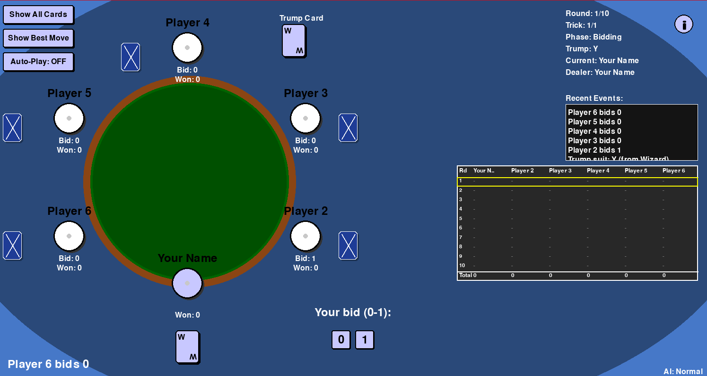
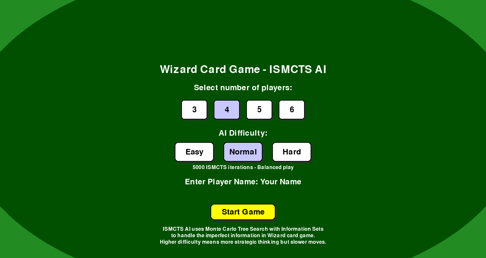
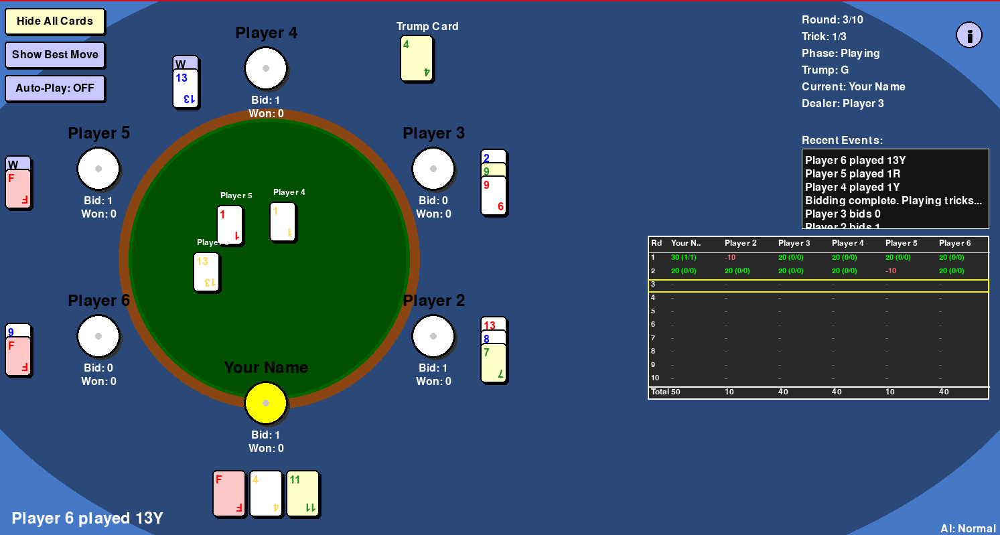

# Wizards & Jesters

## Overview
A Python implementation of the popular trick-taking game Wizard, originally designed by Ken Fisher, in single player mode against an ai using Information Set Monte Carlo Tree Search (ISMCTS) 


## Features

- Fully implemented Wizard rules

- Supports 3–6 players 

- Smart AI powered by Information Set Monte Carlo Tree Search (ISMCTS)

- Selectable AI difficulty: Easy, Medium, Hard

- User interface with buttons, score display and in-game assistance

- Auto-scoring permanent scoreboard and game log

- "Show Best Move" assistant (AI suggests human player’s move)





## Gameplay Overview

Wizard is a trick-taking game where players:

- Predict (bid) how many tricks they'll win each round

- Play cards trying to match their bid exactly

- Use Wizards (always win) and Jesters (always lose) to manipulate outcomes

- The top card of the undealt deck determines the trump suit for the round

- The first card played in a trick sets the led suit – players must follow it if they can

- Trump suit beats all other suits (except Wizards).

- The player with the most accurate bids over all rounds wins!


**Important Diference:** When a Wizard is revealed as trump card, a trump suit is randomly selected instead of player choosing. 


## UI Overview
- Setup Phase:

    - Choose number of players

    - Customize human player name

    - Select AI difficulty (Easy, Medium, Hard)



- During Gameplay:

    -  Show All Cards Button – view all players card

    - Show Best Move Button – run ISMCTS for human player

    - Auto Play Button – AI plays for all players

    - Scrollable game log (right panel)

    - Scoreboard for all rounds

    - Info Button – overlay instructions on how to play

    - Game logs automatically saved after each match



## Setup Instructions

### Clone the repository (or Download):


```
git clone https://github.com/Anastasis-Kon/Wizards-Jesters.git
cd Wizards-Jesters
```

###  Requirements:

- **Python 3.12.9**
- **Pygame 2.6.1**

### Install dependencies with:

```pip install pygame==2.6.1```

### Start the game with:

```python main.py```

## Game Log
At the end of each game, a log file is saved with:

- Timestamp

- Number of players

- Round-by-round bids, tricks won and scores

Saved as: wizard_game_log.txt (append mode)

## --Disclaimer--
This is a hobby project from someone with no experience in game development and a crude implementation of the ISMCTS algorithm. Simply inspired by a game night playing the original board game and wanted to recreate a fun game. There are free sites where you can play Wizard online with friends! 

## File Structure

Wanted to keep the layout simple and didn't add any assets.
```
├── main.py           # Entry point: runs game and set up phase UI
├── game_state.py     # Game logic: rules, turns, bidding, scoring
├── ai.py             # ISMCTS AI player logic
├── ui.py             # UI layout
├── Images/           # Folder for game images
└── README.md         # You're reading this!
```
